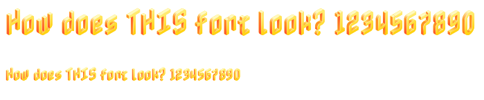
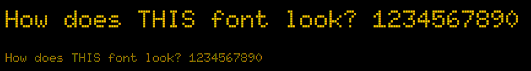
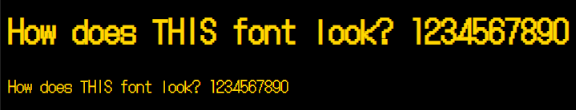
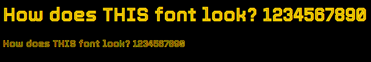
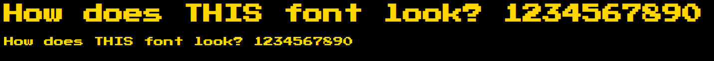

# Fonts

<b>Nabla:</b> This was the first font I tried. it is okay, honestly not my favorite. I wasn't able to change the color of the letters; it is stuck as that yellowish gold. Will not use.

---

<b>Doto:</b> I like this font a lot. It has that pixely aspect to it that I associate with retro games. The color of the font is able to be changed, which is a necessity. Possible contender

---

<b>Doto Gothic:</b> This font is fine. I am not a fan of the difference in heights between the capital T and H. I prefer standard Doto style over this. Will not be using.

---

<b>Tourney:</b> I do like this font. I can't confidently say it fits the Galaga theme; feels mroe like Tron to me. Possible contender.

---

<b>Press-start-2p:</b> This is a pretty standard font. Not much to it, but it doesn't need much going on. Possible Contender
