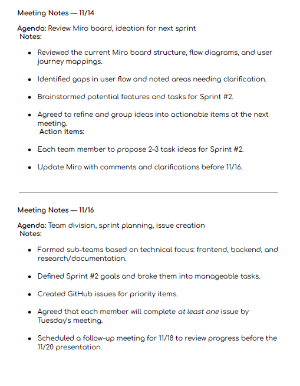
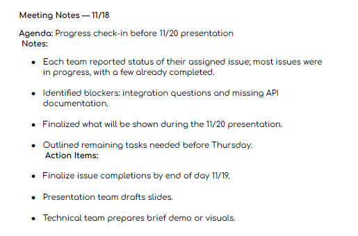
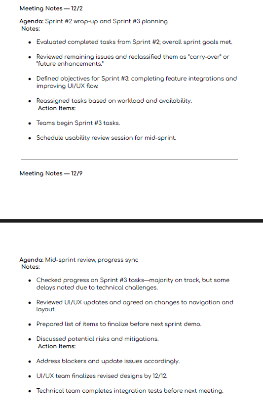
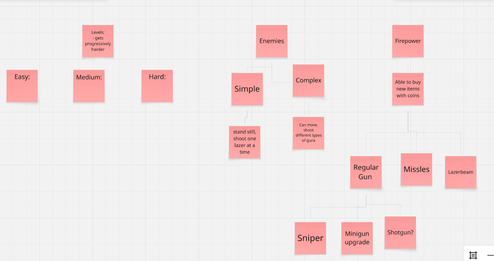
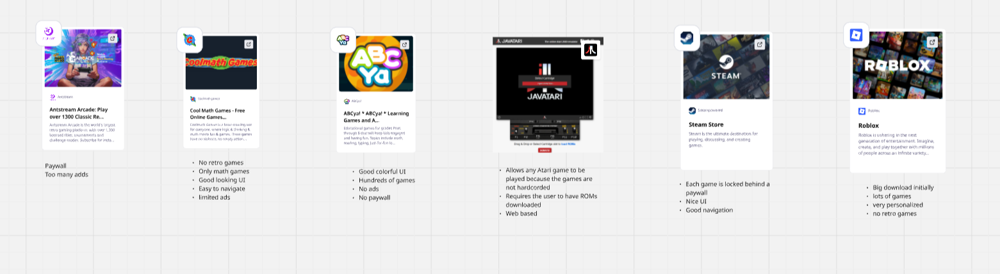
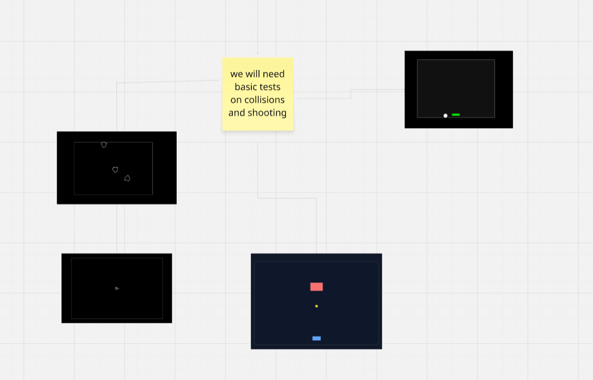

# RetroGa – A Love Letter to Classic Arcade Shooters

**RetroGa** is a full-featured, zero-dependency Galaga-inspired arcade shooter built entirely with vanilla JavaScript, HTML5 Canvas, and modern CSS.  
No frameworks. No build tools. Just pure, performant retro joy.

Play it now → https://gable0.github.io/team-Ctrl-Alt-Elite-testproject/

## Features

- Classic arcade gameplay: waves of enemies, dive-bombing your ship
- 4×10 enemy formation with staggered entry, oscillation, and dive attacks
- Power-ups (triple-shot), lives system, level progression
- High-score board with local persistence
- Currency system – earn coins, spend them in the shop
- Skin system – change enemy and ship appearance (Square Pack, Star Pack, Prof Pack and more!)
- Full settings panel: volume, language, Fun Mode (Chloe’s legendary shooting sound)
- Pause menu, difficulty selection, responsive design
- 100% ES Modules, mobile-friendly, works offline

## Quick Start

```bash
git clone https://github.com/Gable0/team-Ctrl-Alt-Elite-testproject.git
cd team-Ctrl-Alt-Elite-testproject
npm install          # installs dev tools (Playwright, Vitest, JSDoc, etc.)
npm run dev          # launches local server at http://localhost:3000
npm run dev          # live-reloading server
npm run lint         # ESLint check
npm run lint:fix     # auto-fix lint issues
npm run format       # Prettier check
npm run format:fix   # auto-format everything
npm test             # run unit tests with Vitest
npm run test:e2e     # run Playwright end-to-end tests
npm run docs         # generate API documentation
npm run docs:open    # generate docs + open in browser


├── assets/                  # images, audio, skins
├── docs/
│   ├── adr/                 # Architecture Decision Records
│   └── documentation-generation/  # auto-generated JSDoc HTML docs
├── js/
│   ├── core/                # game loop, input, state
│   ├── entities/            # player, enemyManager, bullets
│   ├── systems/             # audio, collision, scoring
│   ├── skins/               # skinsManager, skinAssets
│   └── ui/                  # HUD, pause, settings, shop
├── tests/                   # Vitest unit tests
├── index.html               # entry point / homepage
├── game.html                # main gameplay canvas
├── shop.html                # skin shop
├── skins.html               # skin library (equip)
└── styles.css
```

# RetroGa – Quick Start Guide

## How to Play (2 Minutes to Arcade Glory)

1. **Open `homepage.html`** in your browser  
   (No server needed — just double-click the file!)

2. **Click "Start Game"**  
   → Takes you to difficulty selection

3. **Choose your difficulty**
   - **Easy** (green) – forgiving for newcomers
   - **Medium** (yellow) – balanced challenge
   - **Hard** (red) – pure arcade fury

4. **Blast aliens!**
   - **Move**: Arrow Keys or WASD
   - **Shoot**: Spacebar
   - **Pause**: ESC (Resume/Restart/Exit)
   - **Settings**: pause icon (volume, language)

## Pro Tips

- Destroy enemies for coins → spend in **Shop** (new looks!)
- **Skins Library** – equip your purchased packs
- Earn power-ups for triple-shot mayhem
- Survive waves → level up → high scores await!

**High Score? Share it with the team!**  
_Blast off → RetroGa awaits._

## Team Notes

**Team Meeting Notes**







**Miro Board**

- We used Miro to organize our ideas and brainstorm.
  

- Conducted some competitive analysis.
  

- Linked some proof of concepts and demos.
  

- **[A link to our miro board](https://miro.com/app/board/uXjVJsnu5Nk=/)**

## Credits

Made with passion by Team Ctrl-Alt-Elite

Inspired by Namco’s Galaga (1981)

May your high score live forever.
